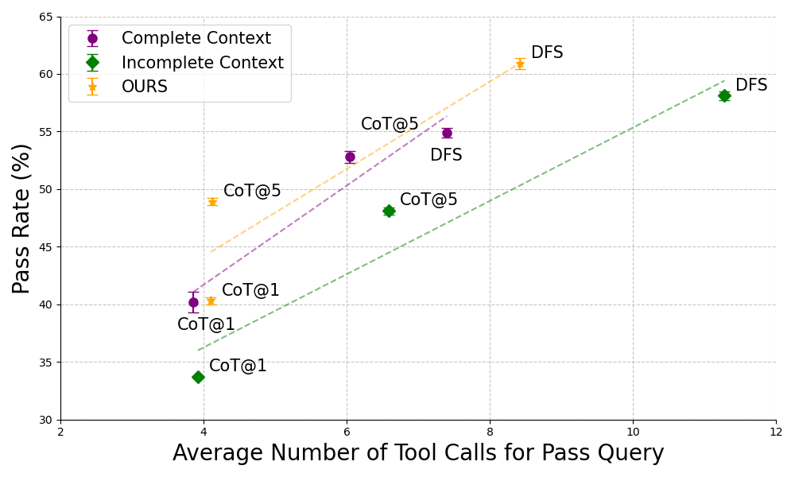
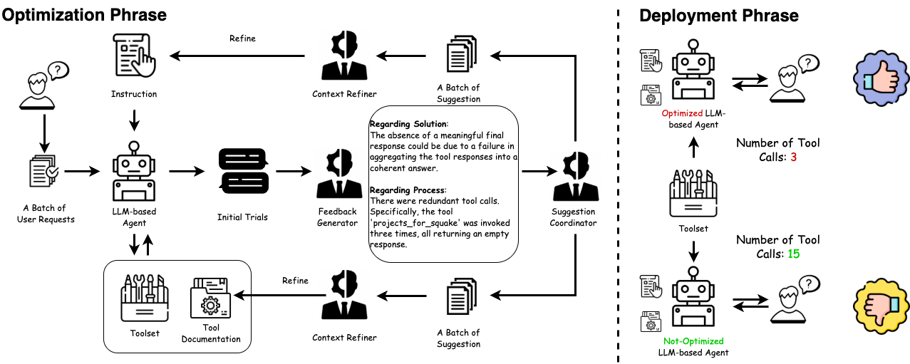

# A Joint Optimization Framework for Enhancing Efficiency of Tool Utilization in LLM Agents
This repository provides the code for our *ACL 2025* paper titled **[A Joint Optimization Framework for Enhancing Efficiency of Tool Utilization in LLM Agents]()**, making the integration of our code contributions into other projects more accessible.

<div align="center">

  []()
  [](https://pytorch.org/)
  [](https://opensource.org/licenses/MIT)
</div>


<p align="center">
  </a>
  <br />
  <em>Pass Rate and Average Number of Tool Calls for Pass Query on G1-instruction between complete context and incomplete context, among three different Inference Scaling algorithms (CoT@1, CoT@5, and DFS). <b> Our key findings: (a) incomplete context easily leads to inefficiency issues (<ins>green line v.s. purple line</ins>); (b) Our proposed optimization system can improve the efficiency of incomplete context (<ins>organe line</ins>). </b></em>
</p>

<p align="center">
  </a>
  <br />
  <em>Our optimization framework consists of three key components: (1) <b> Stepwise and Pairwise Feedback Generator </b> for Generating Verbalized Feedback on Final Response and Tool Calls. (2) <b> Improvement Suggestion Coordinator </b> for Generateing Separate Improvement Suggestions for Instructions and Tool Description. (3) <b> Batch Context Refiner </b> for Aggregating Multiple Improvement Suggestions.</em>
</p>

## Overview
You can reproduce the experiments of our paper [A Joint Optimization Framework for Enhancing Efficiency of Tool Utilization in LLM Agents]().

> **Abstract**
> Large Language Models (LLMs) augmented with external tools have demonstrated remarkable capabilities in complex problem solving. Existing algorithms for tool utilization typically involve an LLM agent which contains instructions on using the description of the available tools to determine and call the tools required to solve the current problem. Most current algorithms utilize methods such as chain-of-thought and tree-of-thought reasoning, requiring significant computational overhead and rendering such methods impractical in real-world applications. In this work, we recognize and formalize the critical role of instructions provided in agent prompts and tool descriptions---collectively referred to as *context*---and show that incomplete *context* is one of the reasons for this computational overhead. To fill this efficiency gap, we propose an optimization framework that jointly refines both the instructions provided in the agent prompt and tool description, enhancing their interaction. Experiments on StableToolBench demonstrate that our optimized agents achieve superior efficiency while maintaining effectiveness. Our findings underscore the critical role of context optimization in improving LLM agents for tool utilization, paving the way for more responsive and cost-effective LLM agents.
> 


## 0. Project Structure


```
.
├── README.md
├── requirements.txt
├── new_metrics                       # CAPR Evaluation
├── optimization                      # Optimization Framework
├── solvable_queries                  # Query Dataset
│   ├── agent_test_instruction        # Agent Test Set
│   ├── test_instruction              # original toolbench
│   ├── tool_test_instruction         # Tool Test Set
│   ├── training_instruction          # Training Set
├── toolbench                         # ToolBench
├── ...
```

## 1. Requirements and Installation
To install the required packages for our baseline approaches (semi-supervised approaches), you can run the following command.
1. Set up a virtual environment:
```sh
python -m venv .venv
source .venv/bin/activate  # On macOS/Linux
# or
.venv\Scripts\activate    # On Windows
```
2. Install the requirements:
```sh
pip install -r requirements.txt
```

## 2. Environment
Please follow [StableToolBench](https://github.com/THUNLP-MT/StableToolBench/tree/master) to download the dataset, and deploy tool server.

## 3. Usage

### Running on Training Set
Running on Training Set to Obtain the trials for optimization.
```sh
bash inference_chatgpt_training.sh
```

### Running Optimization
Running our oprimization framework on trials from training set
```sh
bash run_optimization.sh
```

### Running on Testing Set
Running on both of Tool Test Set and Agent Test Set across CoT@5 (chain-based) and DFS (tree-based).
```sh
bash inference_chatgpt_testing.sh 
```

### Convert Answer and Evaluation
Converting to the final answer and running evaluation (i.e., Pass Rate and Cost-Aware Pass Rate) on answers.
```sh
bash run_convert_answer.sh
bash run_pass_rate.sh
bash run_capr.sh
```


## Bugs or questions?
If you have any questions regarding the code or the paper, please feel free to reach out to Authors at `bin.wu.23@ucl.ac.uk`.  If you experience any difficulties while using the code or need to report a bug, feel free to open an issue. We kindly ask that you provide detailed information about the problem to help us provide effective support.


## Citation
```

```

## Acknowledgements
We would like to thank the authors of the following repositories for providing the codebase:
- [StableToolBench](https://github.com/THUNLP-MT/StableToolBench/tree/master)